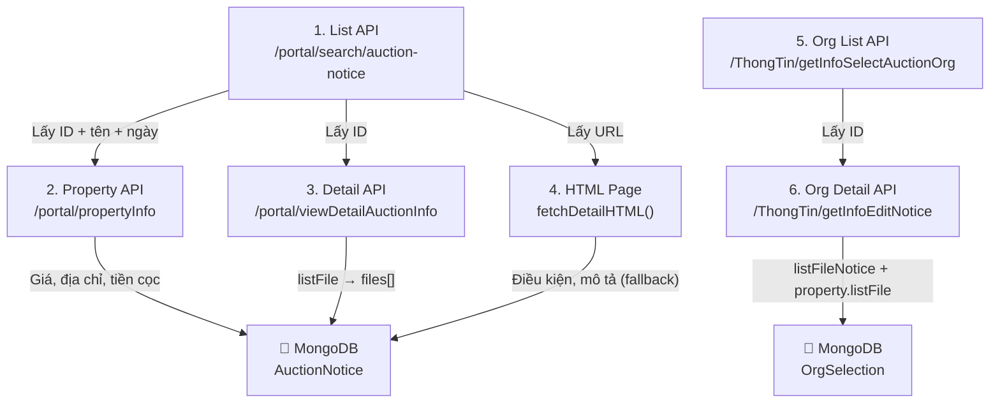

# 📊 Phân Tích API – Trang Đấu Giá `dgts.moj.gov.vn`

> Phân tích ngày: 23/04/2026 | Trang: **Thông báo công khai việc đấu giá**

---

## 1. Tổng Quan Hệ Thống

Trang `dgts.moj.gov.vn` sử dụng **AngularJS SPA** với:
- **FEC (Front-End Challenge)**: Anti-bot protection, yêu cầu browser thật để vượt qua
- **AJAX requests**: Tất cả dữ liệu được tải qua các endpoint REST trả JSON
- **Bảo mật session**: Kiểm tra `Cookie` phiên + Header `X-Requested-With: XMLHttpRequest`

---

## 2. Danh Sách Các API

### API 1: 📋 Danh sách Thông báo đấu giá (List)

| Thông tin | Giá trị |
|-----------|---------|
| **Endpoint** | `/portal/search/auction-notice` |
| **Method** | `GET` |
| **Dùng trong bot** | `config.endpoints.auctionNoticeList` |

**Parameters (Query String):**

| Param | Kiểu | Mô tả |
|-------|------|-------|
| `p` | number | Số trang (bắt đầu từ 1) |
| `numberPerPage` | number | Số bản ghi / trang (mặc định 20) |
| `nameAsset` | string | Tìm kiếm theo tên tài sản (optional) |
| `propertyTypeId` | number | Lọc theo loại tài sản (optional) |
| `provinceId` | number | Lọc theo tỉnh (optional) |

**Response JSON:**
```json
{
  "rowCount": 545353,        // Tổng số bản ghi trên server
  "pageCount": 27268,        // Tổng số trang
  "items": [                 // Mảng các item
    {
      "id": 561058,                          // ⭐ ID duy nhất
      "propertyName": "Quyền sử dụng đất...",// Tên tài sản
      "subPropertyName": "...",              // Tên phụ/mô tả ngắn
      "titleName": "...",                    // Tiêu đề
      "publishTime1": "22/04/2026 15:30",   // Thời gian đăng 1
      "publishTime2": "22/04/2026 15:30",   // Thời gian đăng 2
      "aucTime": "25/05/2026 08:00",        // Thời gian đấu giá
      "aucRegTimeStart": "22/04/2026",       // Bắt đầu đăng ký
      "aucRegTimeEnd": "23/05/2026",         // Hạn đăng ký
      "fullname": "Ông Nguyễn Văn Phương",  // Người có tài sản
      "org_name": "Công ty Đấu Giá Hợp Danh XYZ", // Tổ chức đấu giá
      "propertyTypeId": 1,                   // ID loại tài sản
      "propertyTypeName": "Quyền sử dụng đất" // Tên loại tài sản
    }
  ]
}
```

> [!IMPORTANT]
> API này **KHÔNG trả về giá**, tiền đặt trước, hay file đính kèm. Cần gọi thêm API chi tiết.

---

### API 2: 🔍 Chi tiết Thông báo đấu giá (Detail + Files)

| Thông tin | Giá trị |
|-----------|---------|
| **Endpoint** | `/portal/viewDetailAuctionInfo` |
| **Method** | `GET` |
| **Dùng trong bot** | `detail.scraper.js → crawlDetails()` |

**Parameters:**

| Param | Kiểu | Mô tả |
|-------|------|-------|
| `auctionInfoId` | number | ID của thông báo (lấy từ List API) |

**Response JSON:**
```json
{
  "auctionInfoId": null,       // Có thể null nếu không có session đầy đủ
  "auctionInfo": {             // ⚠️ Có thể null khi thiếu session
    "id": 561058,
    "propertyName": "...",
    "subPropertyName": "..."
  },
  "listFile": [                // ⭐ MẢNG CÁC FILE ĐÍNH KÈM
    {
      "idFile": 666674,
      "fileName": "Thông báo 10.doc",
      "linkFile": "TDNVd01TOWlkSEJrWjNSekwyWnBi..."  // Base64 encoded path
    },
    {
      "idFile": 666675,
      "fileName": "Quy Chế so 10.docx",
      "linkFile": "TDNVd01TOWlkSEJrWjNSekwyWnBi..."
    }
  ],
  "isBlock": null
}
```

**URL tải file:**
```
https://dgts.moj.gov.vn/portal/downloadFile?linkFile={encodeURIComponent(linkFile)}
```

> [!NOTE]
> Trường `listFile` luôn trả về đầy đủ ngay cả khi `auctionInfo` bị `null`. Đây là nguồn chính để lấy file đính kèm.

---

### API 3: 🏠 Thông tin Tài sản (Property Info)

| Thông tin | Giá trị |
|-----------|---------|
| **Endpoint** | `/portal/propertyInfo` |
| **Method** | `GET` |
| **Dùng trong bot** | `detail.scraper.js → crawlDetails()` |

**Parameters:**

| Param | Kiểu | Mô tả |
|-------|------|-------|
| `auctionInfoId` | number | ID thông báo |

**Response JSON:**
```json
{
  "items": [
    {
      "propertyName": "Quyền sử dụng đất...",
      "propertyPlace": "Tổ 2, phường Nam, Gia Nghĩa, Đắk Nông", // ⭐ Địa chỉ chi tiết
      "propertyStartPrice": 1500000000,     // ⭐ Giá khởi điểm (VNĐ)
      "deposit": 300000000,                  // ⭐ Tiền đặt trước
      "fileCost": 500000,                    // ⭐ Phí hồ sơ
      "propertyAmount": "1 thửa đất",       // Số lượng tài sản
      "propertyQuality": "Quyền sử dụng đất" // Chất lượng/loại
    }
  ]
}
```

> [!TIP]
> API này trả về **giá chính xác dạng số** (không cần parse chuỗi). Đây là nguồn đáng tin nhất cho `initialPrice`, `deposit`, `applicationFee`.

---

### API 4: 📄 Danh sách Lựa chọn Tổ chức (Org Selection List)

| Thông tin | Giá trị |
|-----------|---------|
| **Endpoint** | `/ThongTin/getInfoSelectAuctionOrg` |
| **Method** | `GET` |
| **Dùng trong bot** | `config.endpoints.orgSelectionList` |

**Parameters:**

| Param | Kiểu | Mô tả |
|-------|------|-------|
| `p` | number | Số trang |
| `numberPerPage` | number | Số bản ghi / trang |

**Response JSON:**
```json
{
  "rowCount": 95803,
  "pageCount": 4790,
  "items": [
    {
      "id": 102933,
      "propertyName": "Quyền sử dụng 11 lô đất...",
      "subPropertyName": "...",
      "fullname": "UBND phường Trần Liệu",
      "receiveTimeStart": "01/04/2026",
      "receiveTimeEnd": "15/04/2026",
      "lastUpdated": "01/04/2026",
      "propertyTypeId": 1,
      "propertyTypeName": "Quyền sử dụng đất"
    }
  ]
}
```

---

### API 5: 📑 Chi tiết Lựa chọn Tổ chức (Org Selection Detail)

| Thông tin | Giá trị |
|-----------|---------|
| **Endpoint** | `/ThongTin/getInfoEditNotice` |
| **Method** | `GET` |
| **Dùng trong bot** | `detail.scraper.js → crawlOrgDetails()` |

**Parameters:**

| Param | Kiểu | Mô tả |
|-------|------|-------|
| `id` | number | ID từ Org Selection List |

**Response JSON:**
```json
{
  "notice": {                        // Thông tin thông báo
    "id": 102933,
    "title": "...",
    "content": "..."
  },
  "listFileNotice": [                // ⭐ File thông báo
    {
      "idFile": 12345,
      "fileName": "Thong_bao.pdf",
      "linkFile": "base64_encoded_path..."
    }
  ],
  "property": [                      // Danh sách tài sản
    {
      "propertyName": "...",
      "listFile": [                  // ⭐ File tài sản
        {
          "idFile": 12346,
          "fileName": "Ho_so_tai_san.docx",
          "linkFile": "base64_encoded_path..."
        }
      ]
    }
  ]
}
```

**URL tải file (Org):**
```
https://dgts.moj.gov.vn/ThongTin/downloadFile?linkFile={encodeURIComponent(linkFile)}
```

> [!WARNING]
> Prefix khác biệt: File Auction dùng `/portal/downloadFile`, File Org Selection dùng `/ThongTin/downloadFile`

---

### API 6: 🔧 APIs Phụ trợ

| Endpoint | Method | Mô tả |
|----------|--------|-------|
| `/common/getListPropertyType` | GET | Danh sách loại tài sản |
| `/common/getListProvince` | GET | Danh sách tỉnh/thành phố |
| `/common/getListDistrict` | GET | Danh sách quận/huyện |

---

## 3. Luồng Dữ Liệu (Bot Crawl Flow)



## 4. Tóm Tắt Quan Trọng

| Đặc điểm | Giá trị |
|-----------|---------|
| **Tổng Auction Notices trên server** | ~545,000+ |
| **Tổng Org Selections trên server** | ~95,000+ |
| **ID trùng tên** | Rất phổ biến (nhiều lô cùng khu đất) |
| **Key duy nhất** | `sourceId` (= `id` từ API) |
| **Cần gọi bao nhiêu API/item** | 3 API (list + propertyInfo + viewDetail) |
| **Anti-bot** | FEC challenge, cần Puppeteer visible mode |
| **Headers bắt buộc** | `X-Requested-With: XMLHttpRequest`, `credentials: same-origin` |
