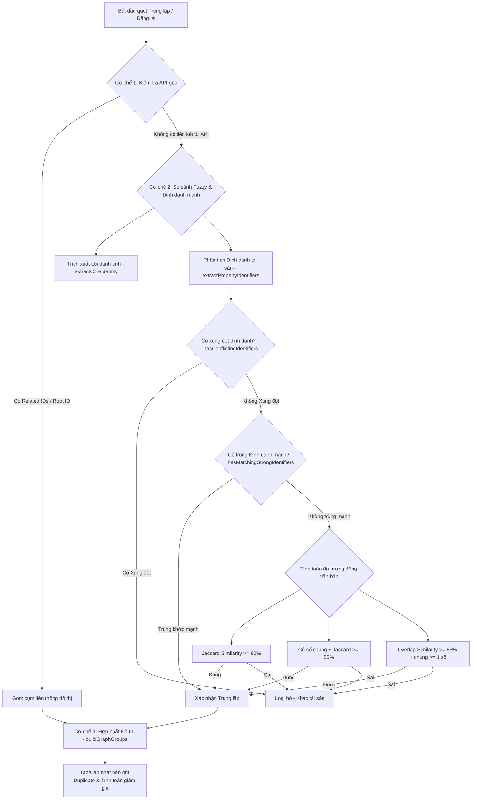

# Hướng Dẫn Về Logic Gộp Nhóm Bài Viết Liên Quan (Relisted / Deduplication)

Tài liệu này giải thích chi tiết kiến trúc dự án Thống kê Đấu giá và logic cốt lõi giúp phát hiện, gộp nhóm các bài viết liên quan (bài đăng lại - relisted) khi đấu giá tài sản.

---

## 1. Tổng Quan Kiến Trúc Dự Án
Dự án được phát triển nhằm thu thập, chuẩn hóa, phân tích và hiển thị thông tin đấu giá tài sản công, bất động sản, xe cộ,... từ cổng thông tin gốc.

*   **Bộ Thu Thập (Crawler Bot):** Viết bằng Node.js, chịu trách nhiệm cào danh sách tài sản đấu giá và thông tin chi tiết bằng cách gọi trực tiếp các API của cổng thông tin gốc (`dgts.moj.gov.vn`).
*   **Cơ Sở Dữ Liệu (MongoDB):**
    *   `AuctionNotice`: Lưu các thông báo đấu giá độc lập (mỗi lần đăng có 1 `sourceId` khác nhau).
    *   `Duplicate`: Lưu thông tin nhóm các bài đăng đã được gộp (chứa mảng `sourceIds` liên kết với các bản ghi `AuctionNotice`).
    *   `CrawlLog`: Lưu nhật ký các tiến trình cào và quét trùng lặp.
*   **Giao Diện Người Dùng (Next.js & React):** Hiển thị danh sách các tài sản đã gộp nhóm, lịch sử đăng lại, tỷ lệ giảm giá qua các lần đấu giá.

---

## 2. Logic Phát Hiện và Gộp Nhóm Bài Viết Liên Quan

Hệ thống sử dụng **3 cơ chế độc lập nhưng bổ trợ cho nhau** để xác định xem các bài đăng có thuộc về cùng một tài sản hay không:

### 2.1. Cơ chế 1: Liên Kết từ Hệ Thống Gốc (API-based Relisting)
Đây là cơ chế chính xác nhất vì nó dựa trên dữ liệu liên kết có sẵn của Cổng thông tin đấu giá quốc gia.

*   **Hàm thực hiện:** `fetchPublishHistory(sourceId)` trong [detail.scraper.js](file:///d:/web-thong-ke-dau-gia/bot-crawls-data/src/scrapers/detail.scraper.js#L61-L108).
*   **Cách hoạt động:** Khi cào chi tiết một tài sản, crawler gọi đồng thời 2 API:
    1.  `/portal/pageAuctionInfoPublish2?auctionInfoId=X`: Trả về danh sách tất cả các đợt công bố của tài sản đó (ví dụ: Lần 1, Lần 2, Lần 3...). Từ đây, hệ thống lấy được nhãn đợt đăng (`publishRoundLabel` như *"Thông báo công khai lần 2"*), mã gốc (`rootId`) và danh sách các ID của những lần đăng khác (`relatedIds`).
    2.  `/portal/pageAuctionInfoCorrections?auctionInfoId=X`: Trả về các ID của các đợt đính chính hoặc chỉnh sửa thông tin liên quan đến tài sản đó.
*   **Kết quả:** Hệ thống gộp tất cả các `sourceId` tìm thấy từ hai API này lại để tạo liên kết ban đầu.

---

### 2.2. Cơ chế 2: Thuật Toán So Sánh Tên và Định Danh (Fuzzy Match & Identifiers)
Trong nhiều trường hợp, hệ thống gốc không trả về `relatedIds` (do lỗi nhập liệu hoặc đăng mới hoàn toàn dưới dạng tin khác). Khi đó, hệ thống sử dụng thuật toán phân tích văn bản nâng cao trong [helpers.js](file:///d:/web-thong-ke-dau-gia/bot-crawls-data/src/utils/helpers.js).

#### Bước 1: Trích xuất "Lõi danh tính" tài sản (`extractCoreIdentity`)
Tên tài sản đấu giá thường chứa rất nhiều văn bản pháp lý rác (boilerplate) làm loãng thuật toán so sánh. Hàm `extractCoreIdentity` sẽ:
*   Chuẩn hóa bảng mã ký tự tiếng Việt (NFC/NFD), loại bỏ dấu và chuyển về viết thường.
*   Thay thế các từ viết tắt phổ biến: `qsdd` $\rightarrow$ `quyen su dung dat`, `bks` $\rightarrow$ `bien kiem soat`, `tbd` $\rightarrow$ `to ban do`.
*   Loại bỏ ngoặc đơn và các cụm từ pháp lý thừa: *"Quyền sử dụng đất và tài sản gắn liền với đất tại..."*, *"kê biên thi hành án..."*, *"Ủy ban nhân dân..."*, *"tổ chức đấu giá..."*.
*   Loại bỏ đơn vị hành chính kèm tên và số: *"phường 12, quận 1"*, *"phường Võ Thị Sáu"*, *"tỉnh Lâm Đồng"*.
*   Loại bỏ các thông số kỹ thuật rác: *"lộ giới đường..."*, *"kết cấu..."*.
*   **Mục tiêu:** Giữ lại chuỗi ký tự tinh gọn nhất chứa thông tin duy nhất của tài sản (ví dụ: *"120/4 nguyen van cu thửa 45 tờ 12"*).

#### Bước 2: Phân tích Định danh tài sản (`extractPropertyIdentifiers`)
Sử dụng các mẫu biểu thức chính quy (Regex) để bóc tách các trường thông tin có cấu trúc:
*   **Đất đai:** Số thửa (`plotNumber`), số tờ bản đồ (`mapSheet`).
*   **Phương tiện:** Biển kiểm soát (`licensePlate`), số khung (`chassisNumber`), số máy (`engineNumber`).
*   **Giấy tờ pháp lý:** Số GCN/Sổ đỏ (`certificateNumber`), số vào sổ cấp GCN (`certificateEntryNumber`), số hợp đồng (`contractNumber`), mã số thuế (`taxCode`).
*   **Căn hộ/Tòa nhà:** Số căn hộ (`apartment`), tòa/block (`block`), ki-ốt (`kiosk`), số nhà (`houseNumber`).
*   **Thông tin khác:** Diện tích (`area`), tên chủ tài sản (`ownerName`), tên ngân hàng (`bankName`).

#### Bước 3: Kiểm tra Xung Đột Định Danh (`hasConflictingIdentifiers`)
Trước khi so sánh độ tương đồng, hệ thống kiểm tra xem có xung đột thông tin hay không.
> [!IMPORTANT]
> Nếu hai tài sản có cùng một loại trường định danh nhưng giá trị khác nhau, chúng sẽ bị **bỏ qua lập tức** (xác định là hai tài sản khác nhau).
> *   *Ví dụ:* Cùng ở một con đường nhưng một bên ghi `Thửa đất số: 10`, một bên ghi `Thửa đất số: 11` $\rightarrow$ Không gộp nhóm.
> *   *Ví dụ:* Khác Quận/Huyện hoặc khác Xã/Phường $\rightarrow$ Không gộp nhóm.
> *   *Ví dụ:* Diện tích đất chênh lệch lớn hơn 2.0 $m^2$ $\rightarrow$ Không gộp nhóm.

#### Bước 4: Kiểm tra Khớp Định Danh Mạnh (`hasMatchingStrongIdentifiers`)
Nếu không có xung đột, hệ thống kiểm tra xem có trùng khớp định danh mạnh hay không:
*   Trùng khớp hoàn toàn một trong các trường: **Số khung, số máy, biển số xe, số sổ đỏ (GCN), số đăng ký tàu, mã số thuế, số hợp đồng**.
*   Hoặc trùng khớp đồng thời cả cặp **Số thửa đất** và **Số tờ bản đồ**.
> [!TIP]
> Nếu thỏa mãn điều kiện này, hệ thống sẽ **gộp nhóm ngay lập tức** mà không cần xét đến độ tương đồng của phần văn bản còn lại.

#### Bước 5: Tính toán Độ tương đồng văn bản (Fuzzy Similarity)
Nếu không có định danh mạnh nhưng cũng không bị xung đột định danh, hệ thống sử dụng thuật toán so sánh từ ghép đôi (Bigrams):
1.  **Jaccard Similarity $\ge$ 80%:** Chấp nhận gộp (áp dụng cho các tên tài sản được viết gần như giống hệt nhau).
2.  **Jaccard Similarity $\ge$ 55% + Có số chung** (Ví dụ: chung số nhà hoặc một mã số đặc trưng) $\rightarrow$ Chấp nhận gộp.
3.  **Overlap Similarity $\ge$ 85% + Chung ít nhất 1 số:** Chấp nhận gộp (thường dùng khi một bài đăng bị viết rút gọn đi rất nhiều so với bài đăng kia).
4.  **Trùng số căn hộ/số nhà + Độ tương đồng tương đối:** Chấp nhận gộp.

---

### 2.3. Cơ chế 3: Gom Cụm và Hợp Nhất Đồ Thị (Graph Clustering)
Sau khi có các mối liên hệ đơn lẻ (Bài A liên quan Bài B, Bài B liên quan Bài C, v.v.), hệ thống cần gộp tất cả chúng lại thành các nhóm hoàn chỉnh.

*   **Hàm thực hiện:** `buildGraphGroups` và `mergeDuplicateGroups` trong [detail.scraper.js](file:///d:/web-thong-ke-dau-gia/bot-crawls-data/src/scrapers/detail.scraper.js#L358-L475).
*   **Thuật toán:** Xây dựng đồ thị vô hướng.
    *   Mỗi `sourceId` là một nút (Node).
    *   Mối quan hệ liên quan (từ API hoặc Fuzzy Match) là cạnh (Edge).
    *   Sử dụng thuật toán tìm các thành phần liên thông (Connected Components) bằng duyệt đồ thị (DFS/BFS).
*   **Kết quả:** Gom tất cả các bài viết có liên quan trực tiếp hoặc gián tiếp vào một nhóm duy nhất.
    *   *Ví dụ:* Nếu A liên quan đến B (qua API), và B liên quan đến C (qua so sánh tên fuzzy), thì nhóm gộp cuối cùng sẽ chứa cả `[A, B, C]`.

---

## 3. Lưu Trữ và Tính Toán Giảm Giá (Duplicate Model)

Khi một nhóm tài sản được gộp lại, thông tin được lưu trữ vào collection `duplicates` với các logic tính toán giá trị:

*   **Sắp xếp danh sách đợt đăng (`entries`):** Toàn bộ các bài đăng trong nhóm được sắp xếp theo thời gian công bố (`publishedAt`) tăng dần. Lần đăng đầu tiên là `entries[0]`, lần đăng cuối cùng là `entries[entries.length - 1]`.
*   **Giá đầu tiên (`firstPrice`):** Lấy giá khởi điểm (`initialPrice` hoặc `startingPrice`) của lần đăng đầu tiên có giá trị lớn hơn 0.
*   **Giá hiện tại (`latestPrice`):** Lấy giá khởi điểm của lần đăng mới nhất.
*   **Xác định giảm giá (`isPriceDrop`):** Được đánh dấu là `true` khi và chỉ khi:
    1.  Giá đợt mới nhất nhỏ hơn giá đợt đầu tiên (`latestPrice < firstPrice`).
    2.  Có ít nhất 2 thời điểm công bố khác nhau (tránh trường hợp gộp nhầm các tài sản khác nhau đăng cùng ngày).
*   **Phần trăm giảm giá (`priceDropPercent`):** Tính theo công thức:
    $$\text{priceDropPercent} = \frac{\text{firstPrice} - \text{latestPrice}}{\text{firstPrice}} \times 100\%$$

---

## 4. Hiển Thị Ở Giao Diện (Frontend Integration)

Trang hiển thị tài sản đăng lại [RelistedContainer.tsx](file:///d:/web-thong-ke-dau-gia/src/features/relisted/RelistedContainer.tsx) gọi API `/api/relisted` để lấy dữ liệu.

1.  **Dữ liệu kết hợp (Aggregation):** API `/api/relisted` thực hiện `$lookup` để lấy thông tin của bản ghi `AuctionNotice` mới nhất làm đại diện hiển thị (để lấy trạng thái hiện tại, ngày tổ chức đấu giá gần nhất, địa chỉ hiển thị).
2.  **Sắp xếp & Bộ lọc:**
    *   Hỗ trợ sắp xếp theo: Số lần đấu giá giảm dần (`rounds_desc`), phần trăm giảm giá cao nhất (`discount_pct`), tin mới cập nhật (`newest`), hoặc giá thấp nhất (`price_asc`).
    *   Bộ lọc nâng cao cho phép người dùng lọc theo % giảm tối thiểu, số lần đấu giá tối thiểu (ví dụ: lọc các bài đã đấu giá $\ge 3$ lần), khu vực tỉnh/thành, loại tài sản, và đơn vị tổ chức đấu giá.
3.  **Cách trình bày thông tin:**
    *   **Giá cũ (First Price):** Hiển thị ở dạng chữ nhỏ, gạch ngang (ví dụ: ~~1.2 Tỷ~~).
    *   **Giá mới (Latest Price):** Hiển thị nổi bật, chữ đậm.
    *   **Số lần đấu giá (Relist Count):** Hiển thị số lần tài sản này được đưa ra đấu giá (ví dụ: *3 lần ĐG*).
    *   **Nhãn giảm giá:** Badge màu sắc thể hiện phần trăm giảm giá (ví dụ: *-25%*).
