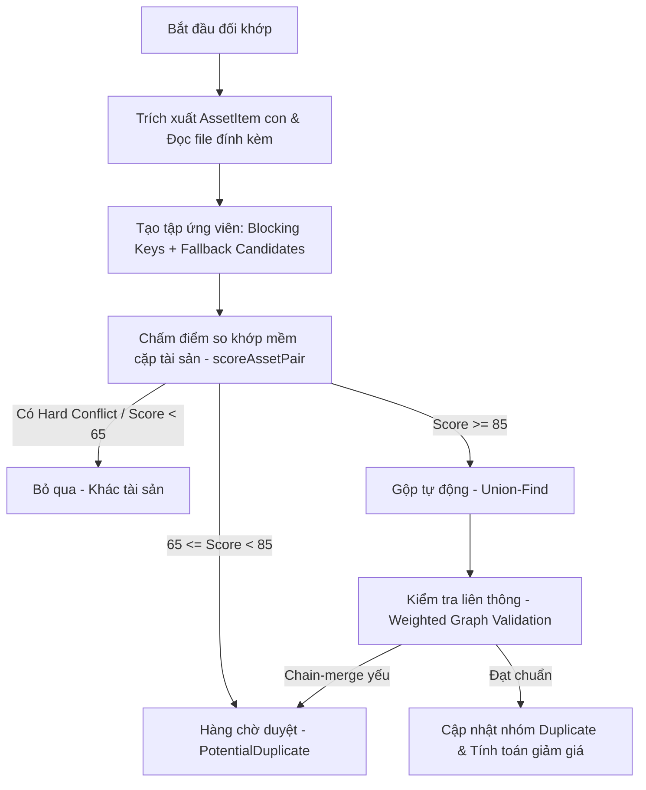

# Hướng Dẫn Kỹ Thuật: Hệ Thống Gộp Trùng Tài Sản (AssetItem Deduplication & Relisting System)

Tài liệu này trình bày toàn bộ kiến trúc, logic đối khớp nâng cấp cấp độ tài sản con (`AssetItem`), thuật toán chấm điểm mềm (`scoreAssetPair`), và các mô-đun mở rộng giúp tối đa hóa khả năng phát hiện tài sản đấu giá lại (relisted) trên cổng thông tin Quốc gia (DGTS).

---

## 1. Tổng Quan Kiến Trúc Cơ Sở Dữ Liệu

Để không bỏ sót tài sản đấu giá lại khi dữ liệu đầu vào không sạch, hệ thống chuyển dịch từ việc so khớp "bài đăng" sang quản lý chi tiết các "tài sản con" thực tế:

*   **`AuctionNotice` / `OrgSelection`**: Chứa thông tin thô của bài đăng gốc được cào về từ hệ thống cổng thông tin.
*   **`AssetItem`**: Lưu trữ các thực thể tài sản con sau khi bóc tách từ thông báo. Mỗi thông báo gốc có thể bóc thành một hoặc nhiều `AssetItem` (khớp bằng unique compound index: `{ sourceType, sourceId, itemIndex }`).
*   **`Duplicate` (AssetGroup-level)**: Lưu trữ các nhóm trùng đã được tự động gộp (chứa mảng liên kết tài sản con `assetItemIds` và lịch sử chi tiết đợt đăng `entries` để hiển thị).
*   **`PotentialDuplicate`**: Lưu trữ các cặp hoặc nhóm nghi ngờ trùng lặp (điểm từ 65 đến 84) cần duyệt thủ công ở trang quản trị.

---

## 2. Quy Trình Trích Xuất & Đối Khớp Chi Tiết



### 2.1. Phân Tách Tài Sản Con (`extractAssetItemsFromNotice`)
Hệ thống không chỉ dựa vào mảng `properties` được trả về từ API gốc mà bóc tách sâu từ:
*   Mảng `properties` có cấu trúc.
*   Nội dung văn bản thô trong `title`, `description`, `shortDescription`.
*   Nội dung văn bản trích xuất từ file đính kèm (Quy chế đấu giá, thông báo đấu giá).
*   Các bảng biểu HTML (`<table>`) và bảng biểu trong tài liệu.

**Thuật toán nhận diện phân mảnh**: Sử dụng Regex nhận diện các mẫu (pattern) phân chia như: `Tài sản 1:`, `Tài sản số 1:`, `Lô 1:`, `STT 1:`, `Thửa đất số...`. Mỗi phân mảnh con sẽ được trích xuất thành 1 `AssetItem` riêng. Trường hợp độ tin cậy bóc tách thấp (`splitConfidence: 'low'`), hệ thống ưu tiên định tuyến tài sản sang hàng chờ duyệt thủ công.

---

### 2.2. Attachment Parser (Đọc File Đính Kèm)
Nhiều thông báo đấu giá có tên tiêu đề cực kỳ chung chung (ví dụ: *"Quyền sử dụng đất..."*). Mọi định danh mạnh đều nằm trong file phụ lục.
*   **Quy trình**: Download và parse các tài liệu đính kèm dạng `.pdf`, `.doc`, `.docx`, `.xls`, `.xlsx`.
*   **Thông tin trích xuất**: Số thửa, tờ bản đồ, diện tích, địa chỉ chi tiết, số GCN/Sổ đỏ, biển số xe, số khung, số máy, danh sách tài sản con dạng bảng, giá khởi điểm từng tài sản.
*   **Merge dữ liệu**: Kết quả trích xuất được tích hợp trực tiếp vào `AssetItem` tương ứng và đánh dấu bằng cờ `attachmentTextUsed = true`.

---

### 2.3. Khởi Tạo Ứng Viên Đa Tầng (Candidate Generation & Fallbacks)
Hệ thống tạo ra một liên hợp (Union) các tập ứng viên thông qua nhiều loại khóa để tránh bỏ sót khi tài sản bị khuyết thông tin:

1.  **Liên kết trực tiếp từ API**: Lấy danh sách `relatedIds` từ cơ chế đồng bộ gốc.
2.  **Khóa Blocking mạnh**:
    *   `land:pm:${province}:${plot}:${map}` (Thửa đất + Tờ bản đồ)
    *   `addr:ph:${province}:${house}` (Số nhà + Tên đường)
    *   `vehicle:plate:${plate}` / `vehicle:chassis:${chassis}` (Mã định danh xe)
3.  **Khóa dự phòng mở rộng (Fallback Candidates)**:
    *   `owner_area:${province}:${ownerCleaned}:${areaRounded}`
    *   `owner_price:${province}:${ownerCleaned}:${priceBucket}`
    *   `location_area_price:${province}:${district}:${areaRounded}:${priceBucket}`
    *   `bank_area:${bankName}:${province}:${areaRounded}`
    *   `address_area:${province}:${street}:${areaRounded}`
    *   `cert_owner:${certificateNumber}:${ownerCleaned}`
4.  **Dự phòng cuối cùng**: Khi khuyết hoàn toàn khóa mạnh, lấy các ứng viên cùng tỉnh + cùng chủ sở hữu cũ, hoặc cùng tỉnh + cùng diện tích làm tròn, hoặc sử dụng tìm kiếm tương đồng ngữ nghĩa (Semantic Embedding).

---

### 2.4. Luật Chấm Điểm Mềm & Xử Lý Xung Đột (`scoreAssetPair`)

#### A. Luật Hard Conflict (Chỉ Reject khi gặp định danh cực mạnh)
Hệ thống không tự động huỷ bỏ khi khác Quận/Huyện/Phường hoặc lệch diện tích/giá vì địa giới hành chính có thể sáp nhập hoặc nhập liệu viết tắt.
**Hard conflict chỉ kích hoạt khi**:
*   Khác số khung xe rõ ràng.
*   Khác số máy xe rõ ràng.
*   Khác biển số xe rõ ràng.
*   Khác số GCN/sổ đỏ rõ ràng.
*   Khác đồng thời cả số thửa và tờ bản đồ tại cùng một vị trí địa lý đã được chuẩn hóa chắc chắn.
*   Khác loại tài sản hoàn toàn (ví dụ: đất vs xe cộ, xe cộ vs máy móc thiết bị).

*Lưu ý (Chassis Typo Bypass)*: Với tài sản xe cộ, nếu khớp $\ge 2$ định danh mạnh (ví dụ trùng biển số + số máy), hệ thống sẽ bỏ qua mọi xung đột của định danh thứ 3 (số khung gõ sai kí tự vẫn gộp tự động).

#### B. Thang Điểm Chấm Mềm (Soft Matches & Soft Conflicts)
*   **Trùng khớp định danh mạnh**: Trùng biển số/khung/máy (**+95**), trùng số GCN (**+85**), trùng cả thửa và tờ bản đồ (**+75**), trùng số nhà (**+60**).
*   **Trùng khớp thông tin địa lý**: Trùng xã/phường (**+20**), trùng quận/huyện (**+15**).
*   **Trùng chủ tài sản cũ**: **+20 điểm**.
*   **Giá đấu giá lại**:
    *   Giá giống nhau: **+8 điểm**.
    *   Giá giảm từ 1% đến 40% (giảm giá hợp lý): **+15 điểm**.
    *   Giá giảm từ 40% đến 70%: **+5 điểm**.
    *   Giá tăng đột biến: **-5 điểm** (không reject thẳng).
*   **Diện tích**: Khớp diện tích trong khoảng chênh lệch chấp nhận được (**+20 điểm**). Lệch diện tích lớn (**-15 điểm**).
*   **Mâu thuẫn địa danh nhẹ (Khác huyện/xã)**: **-15 điểm** (Soft Conflict - dùng để trừ điểm chứ không loại bỏ).

#### C. Đối Khớp Ngữ Nghĩa (Semantic Embedding)
Hệ thống tạo vector embedding cho chuỗi thông tin chuẩn hóa: `assetType + coreIdentity + locationIdentity + ownerCleaned + identifiers + area`.
*   Semantic Score $\ge 0.92$: **+25 điểm**.
*   Semantic Score $0.86 - 0.92$: **+12 điểm**.
*   Độ tương đồng ngữ nghĩa cao kết hợp trùng khớp diện tích/chủ sở hữu: tự động đưa vào hàng chờ duyệt thủ công.

---

### 2.5. Xác Thực Đồ Thị Gom Nhóm (Weighted Graph Validation)
Khi gộp nhóm tự động bằng Union-Find, hệ thống có thể bị hiện tượng gộp dây chuyền sai lệch (Chain Merge - ví dụ A giống B, B giống C, C giống D nhưng A khác D).
*   **Giải pháp**: Lưu trữ các liên kết dưới dạng cạnh đồ thị có trọng số (`MatchEdge` chứa `score`, `reasons`, `matchType`).
*   **Xác thực sau gom cụm**: Một `AssetItem` chỉ được duy trì trong nhóm nếu:
    1.  Có liên kết từ hệ thống gốc (API-based relatedIds).
    2.  Hoặc có ít nhất một liên kết trực tiếp đạt điểm rất mạnh ($\ge 90$ điểm).
    3.  Hoặc có điểm số đối khớp với tài sản đại diện của nhóm (Canonical Item) đạt chuẩn $\ge 75$ điểm.
*   Nếu không thoả mãn các điều kiện trên, hệ thống sẽ tách tài sản ra và đẩy về hàng chờ duyệt thủ công.

---

## 3. Quản Lý Địa Danh & Chủ Thể Alias

Để nâng cao khả năng chuẩn hóa dữ liệu bẩn trước khi so khớp:

### 3.1. Chuẩn Hóa Địa Danh (Location Alias)
Xây dựng bảng từ điển chuyển đổi địa danh cũ/mới và viết tắt:
*   Chuyển đổi các dạng tương đương: `TP. HCM`, `TP Hồ Chí Minh`, `Thành phố Hồ Chí Minh`, `Hồ Chí Minh` $\rightarrow$ `TP. Hồ Chí Minh`.
*   Hỗ trợ sáp nhập hành chính (ví dụ: `thị xã Phú Mỹ` và `thành phố Phú Mỹ` được coi là một địa danh hợp lệ).

### 3.2. Chuẩn Hóa Chủ Thể / Ngân Hàng (Organization Alias)
Hệ thống chuẩn hóa tên các chủ thể phát mãi tài sản phổ biến (đặc biệt là ngân hàng):
*   `BIDV` $\leftarrow$ `Ngân hàng TMCP Đầu tư và Phát triển Việt Nam`, `BIDV Chi nhánh...`
*   `Agribank` $\leftarrow$ `Ngân hàng Nông nghiệp và Phát triển nông thôn Việt Nam`, `Agribank CN...`
*   `VietinBank` $\leftarrow$ `Ngân hàng TMCP Công Thương Việt Nam`, `Vietinbank...`
Các từ khóa như `Chi nhánh`, `Phòng giao dịch`, `CN`, `PGD` được loại bỏ để so khớp phần tên lõi.

---

## 4. Quản Lý Nhóm Trùng Lặp Ngoài Frontend (Duplicate Model)

Để tránh hiện tượng gom nhầm cả bài đăng chứa nhiều tài sản con vào một nhóm đấu giá lại, bảng `Duplicate` được cấu trúc lại như sau:

```javascript
const duplicateSchema = new mongoose.Schema({
  assetGroupId: { type: String, unique: true }, // Định danh nhóm tài sản con trùng lặp
  assetItemIds: [{ type: mongoose.Schema.Types.ObjectId, ref: 'AssetItem' }],
  sourceIds: [Number], // Các sourceId liên quan để hiển thị bài đăng gốc
  
  entries: [{
    sourceId: Number,
    assetItemId: mongoose.Schema.Types.ObjectId,
    itemIndex: Number,
    publishedAt: Date,
    auctionTime: Date,
    price: Number,
    title: String,
    url: String,
    sourceType: { type: String, enum: ['auction_notice', 'org_selection'] }
  }],

  canonicalTitle: String,
  canonicalLocation: String,
  canonicalOwner: String,

  firstPrice: Number,
  latestPrice: Number,
  priceDropPercent: Number,
  relistCount: Number
});
```

### Quy Tắc Tính Toán Chỉ Số Đăng Lại (Relisted):
Không phải mọi thông báo đấu giá đều là vòng đấu giá lại.
*   **Phân biệt nguồn**: Bản ghi từ `OrgSelection` (lựa chọn tổ chức đấu giá) chỉ được dùng để bổ sung định danh tài sản (như số thửa, số GCN) mà không được coi là một vòng đấu giá lại.
*   **Tính toán**: Các chỉ số `relistCount`, `firstPrice`, `latestPrice`, và `priceDropPercent` chỉ được tính toán dựa trên các bản ghi có nguồn gốc từ `AuctionNotice`.
*   **Nhận diện tín hiệu**: Hệ thống kiểm tra thêm các từ khóa đặc trưng đấu giá lại (`đấu giá lại`, `lần 2`, `lần 3`, `hạ giá`, `đấu giá không thành`...) trong tên và nội dung tài sản để củng cố độ chính xác của số vòng đấu giá (`relistCount`).
